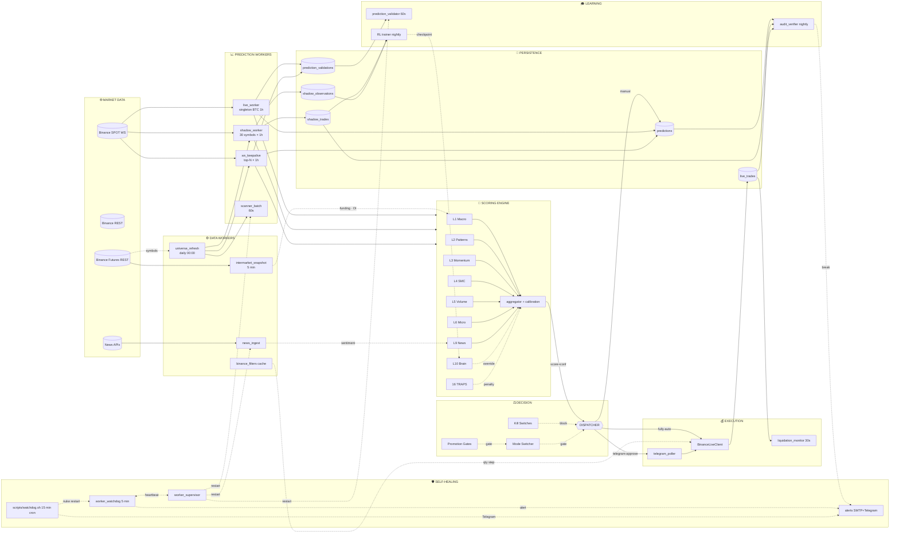
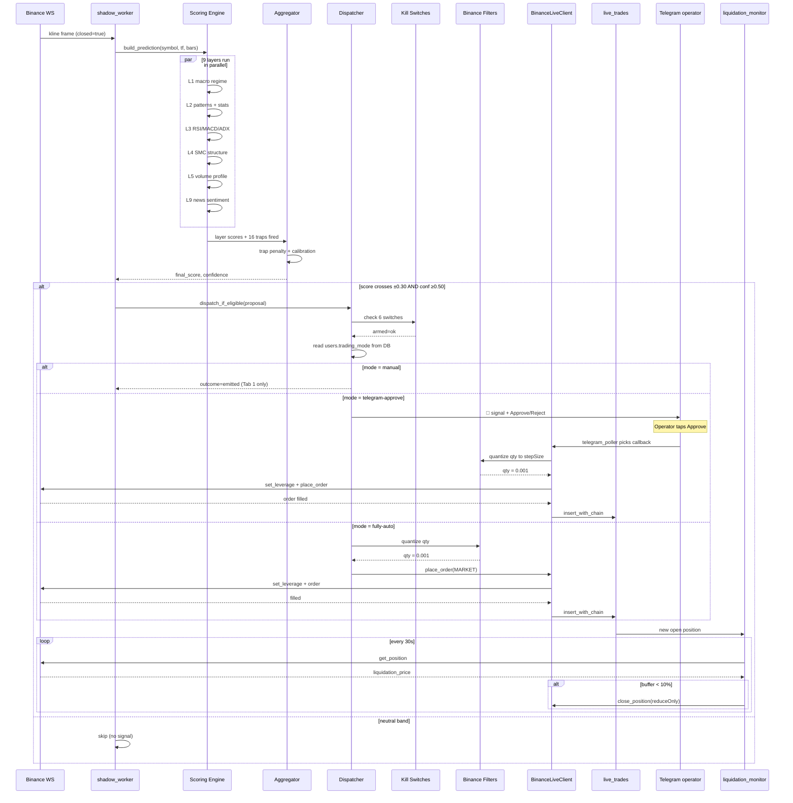
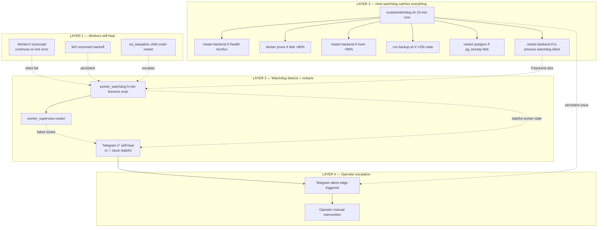

# v5 Trade Bot — System Architecture & Engine Review

**Generated 2026-05-16. Snapshot of the production system after the
autonomous-trading validation session.**

This document is the canonical reference for what runs, how it's wired,
when it fires, and how it recovers from failure. Read top-to-bottom for a
full tour; jump to a specific engine via the table of contents.

---

## Table of contents

1. [The 17 engines (summary)](#the-17-engines)
2. [Scoring engine — 9 layers + traps + aggregator](#1-scoring-engine)
3. [Shadow worker](#2-shadow-worker)
4. [Live prediction worker](#3-live-prediction-worker)
5. [WS keepalive worker](#4-ws-keepalive-worker)
6. [Dispatcher](#5-dispatcher)
7. [Telegram approval poller](#6-telegram-approval-poller)
8. [Mode switcher + promotion gates](#7-mode-switcher--promotion-gates)
9. [Kill switches](#8-kill-switches)
10. [Live trading execution (BinanceLiveClient)](#9-live-trading-execution)
11. [Binance filters module](#10-binance-filters-module)
12. [Self-healing supervisor](#11-self-healing-supervisor)
13. [Watchdog (in-process + host)](#12-watchdog)
14. [Audit hash chain](#13-audit-hash-chain)
15. [RL training pipeline (brain)](#14-rl-training-pipeline)
16. [Background workers (16 in registry)](#15-background-workers)
17. [Scanner (fast-scan)](#16-scanner)
18. [Universe management](#17-universe-management)
19. [ASCII data-flow map](#ascii-data-flow-map)
20. [Mermaid system map](#mermaid-system-map)
21. [Signal lifecycle — one candle end-to-end](#signal-lifecycle)
22. [Cadence map](#cadence-map)
23. [Self-healing topology](#self-healing-topology)
24. [Engine accountability matrix](#engine-accountability-matrix)
25. [The "alive" part — runtime behaviour](#the-alive-part)

---

## The 17 engines

| # | Engine | Path | Role |
|---|---|---|---|
| 1 | Scoring engine (9 layers) | `app/core/scoring/` | Produces `final_score ∈ [-1, +1]` per candle |
| 2 | Shadow worker | `app/shadow/worker.py` | Paper-trading engine; 30 symbols × 1h |
| 3 | Live prediction worker | `app/ws/live_prediction.py` | Per-user chart predictor (BTCUSDT 1h singleton) |
| 4 | WS keepalive worker | `app/ws/keepalive.py` | Fans live-prediction across top-N (NEW) |
| 5 | Dispatcher | `app/trading/execution/dispatcher.py` | Routes signal: manual / telegram-approve / fully-auto |
| 6 | Telegram approval poller | `app/ops/telegram_polling.py` | Inbound callback handler |
| 7 | Mode switcher + promotion gates | `app/trading/modes.py` + `promotion.py` | TOTP-gated mode upgrade with 30d/100tr gates |
| 8 | Kill switches | `app/trading/kill_switches.py` | 6 armed safety triggers |
| 9 | Live trading execution | `app/exchanges/binance_live.py` | Signed Binance Futures REST client |
| 10 | Binance filters module | `app/exchanges/binance_filters.py` | exchangeInfo cache + qty/price quantize (NEW) |
| 11 | Self-healing supervisor | `app/ops/worker_supervisor.py` | Worker registry + auto-restart (NEW) |
| 12 | Watchdog | `app/ops/worker_watchdog.py` + `scripts/watchdog.sh` | 2-layer liveness + heal |
| 13 | Audit hash chain | `app/db/audit.py` | Append-only prev_hash → row_hash on 7 tables |
| 14 | RL training pipeline | `app/rl/` | PPO trainer + brain checkpoint registry |
| 15 | Background workers | `app/main.py` lifespan | 16 spawned tasks in `worker_registry.py` |
| 16 | Scanner | `app/scanner/` | 60s deterministic indicator-only fast-scan |
| 17 | Universe management | `app/shadow/universe.py` + `universe_refresh.py` | Daily top-30 SPOT pairs |

---

## 1. Scoring engine

**Files**: `app/core/scoring/{layer1_macro,…,layer10_brain,aggregator,calibration,run_traps,tiers}.py` + `traps/`

The signal generator. Composes **9 independent layers** that each produce a
`LayerScore(strength, confidence, direction)`. Aggregator combines them
into a single `final_score ∈ [-1.0, +1.0]`.

| Layer | What it scores |
|---|---|
| L1 Macro (`layer1_macro.py`) | Higher-timeframe trend; regime detector (markup/markdown/range/wave) |
| L2 Patterns (`layer2_patterns.py`) | Classical TA patterns (H&S, double-top, flags, wedges) joined with `pattern_stats` historical hit rate |
| L3 Momentum (`layer3_momentum.py`) | RSI, MACD, ADX, Stochastic, OBV cluster |
| L4 SMC (`layer4_smc.py`) | Smart-money concepts: BOS, CHoCH, liquidity sweeps, FVGs, order blocks |
| L5 Volume (`layer5_volume.py`) | Volume profile, VWAP, POC, HVN/LVN |
| L6 Micro (`layer6_micro.py`) | Tape/orderbook microstructure (synthetic in current build) |
| L7 XGBoost (`layer7_xgboost.py`) | ML predictor — currently placeholder (always returns NEUTRAL) |
| L8 ConvLSTM (`layer8_convlstm.py`) | Deep learning sequence model — placeholder until a checkpoint is registered |
| L9 News (`layer9_news.py`) | FinBERT sentiment over `news_items` table |
| L10 Brain (`layer10_brain.py`) | RL policy override (when an active RL checkpoint is loaded) |

**Aggregator** (`aggregator.py`):
- Sums layers; **trap penalty**: each fired trap multiplies the result by `(1 - 0.15) = 0.85`
- Applies `_NEUTRAL_BAND = 0.05` → scores in `[-0.05, +0.05]` → NEUTRAL
- Calibration module applies tanh-soft per-direction multiplier in `[0.7, 1.3]`

**Traps** (`scoring/traps/`): 16 traps that *penalize* a signal. Sample:
parabolic_blowoff, pattern_in_pattern, friday_weekend,
alt_btc_indecision, short_only/borrow_rate, thin_orderbook,
volatility_regime_change, volume_no_followthrough. Traps **never produce
signals** — they only weaken existing ones.

---

## 2. Shadow worker

**File**: `app/shadow/worker.py`

The paper-trading engine. Runs every closed 1h candle on all 30 universe
symbols.

- Subscribes to Binance SPOT WS (`stream.binance.com:9443/stream?streams=...`)
- For each closed candle: builds prediction via scoring engine
- **Entry gate** (symmetric since PR #121): `final_score > 0.30 LONG` or `< -0.30 SHORT`, AND `confidence ≥ 0.50`
- On qualifying signal: opens a `ShadowPosition` with computed SL/TP/ATR, persists to `shadow_trades` (hash-chained) + `shadow_open_positions`
- **Cooldown**: same symbol can't re-enter for 4 hours after close
- Per-candle: walks each open position, exits on SL hit / TP hit / 24-bar timeout
- Captures full 58-float RL observation at trade-open (PR #126) into `shadow_observations`

---

## 3. Live prediction worker

**File**: `app/ws/live_prediction.py`

The single-symbol per-user predictor that powers the chart UI (BTCUSDT 1h
default in production). Same scoring engine as shadow, plus:

- Persists predictions to `predictions` table (hash-chained)
- Writes a `prediction_validations` pending row so the validator worker
  can grade hit/miss later
- Optionally calls `predict_ghost_candle` (ML inference) if an active ML
  checkpoint is loaded
- Calls `dispatch_if_eligible` → goes to the Dispatcher

---

## 4. WS keepalive worker

**File**: `app/ws/keepalive.py` — added 2026-05-15

Removes the "leave a browser tab open" dependency. Fans
`run_live_prediction` across the top-20 universe symbols on 1h
server-side, so `prediction_validations` fills 24/7 without organic UI
traffic. Children crash-isolated via restart-with-backoff. Supervisor
heartbeats every 5 min.

---

## 5. Dispatcher

**File**: `app/trading/execution/dispatcher.py`

Central router. Reads `users.trading_mode` from DB each call (defends
against stale UserContext):

| Mode | Outcome |
|---|---|
| `manual` | `emitted` — signal shows on Tab 1 chart, no auto-action |
| `telegram-approve` | Writes `telegram_signals` row + POSTs to Telegram with Approve/Reject buttons (PR #153 wired this — was unwired before) |
| `fully-auto` | `_place_live_order` — sets leverage, places order on Binance, writes `live_trades` row (hash-chained) |

**Pre-conditions** before placement:
- Kill switches not tripped
- Per-asset cooldown elapsed
- Max concurrent positions not exceeded
- Funding-rate guard not blocking
- qty quantized to symbol's LOT_SIZE.stepSize ≥ min_qty (PR #164)
- notional ≥ MIN_NOTIONAL

---

## 6. Telegram approval poller

**File**: `app/ops/telegram_polling.py`

Long-polls `getUpdates`. On Approve callback:
- Calls `handle_trade_callback` → marks `telegram_signals.response='approved'`
- Calls `_place_approved_order` → same Binance path as `_place_live_order`
  but no funding/max-positions re-check (those ran when the signal was
  first sent)
- Same qty quantization as dispatcher (PR #164)
- Writes `live_trades` row with `approved_via='telegram'`

Also routes `rl_*` callbacks (brain checkpoint approval) to a separate
handler.

---

## 7. Mode switcher + promotion gates

**Files**: `app/trading/modes.py` + `app/trading/promotion.py`

Mode upgrade flow: `manual → telegram-approve → fully-auto`. Requires
**both**:

1. **TOTP code** (2FA gate)
2. **Promotion gates** passing:

| Metric | Telegram threshold | Fully-auto threshold |
|---|---|---|
| Days continuous trading | ≥ 30 | ≥ 90 |
| Closed trades | ≥ 100 | ≥ 300 |
| Sharpe (annualised) | ≥ 1.0 | ≥ 1.5 |
| Max drawdown | ≤ 12% | ≤ 10% |
| Win rate | ≥ 40% | ≥ 45% |
| Profit factor | ≥ 1.5 | ≥ 2.0 |

Stats computed over rolling 30/90 day window of shadow + live trades.
**Downgrades always allowed** — operator can always pull back to manual.

---

## 8. Kill switches

**File**: `app/trading/kill_switches.py`

6 armed switches block new positions when tripped. Disabling requires
TOTP. Default thresholds:

| Switch | Threshold |
|---|---|
| Daily loss | 0.02% of portfolio |
| Consecutive losses | 5 in a row |
| Network outage | 60 s |
| Slippage | 0.005% |
| Liquidation buffer | 0.5% from liq price |
| Funding rate guard | 0.01%/day |

---

## 9. Live trading execution

**File**: `app/exchanges/binance_live.py`

`BinanceLiveClient`: signed REST calls to Binance Futures API. Routes to
`testnet.binancefuture.com` or `fapi.binance.com` based on `use_testnet`.

- `verify_permissions()`: refuses to operate if key has `enableWithdrawals` / transfer scopes
- `place_order(MARKET / LIMIT)` with `set_leverage` first
- `get_position(symbol)`: returns current position state
- `close_position(symbol)`: market-close with `reduceOnly=true`

**Liquidation monitor** (`app/trading/execution/liquidation_monitor.py`):
30s poll of open `live_trades` rows. Auto-closes any position whose
Binance-reported `liquidationPrice` is within 10% of current mark (more
aggressive than spec to avoid Binance forced-liq fees).

---

## 9b. MTF gate + SHORT safety (PR2)

**Files**: `app/trading/execution/dispatcher.py` (3 new helpers + 3 new
DispatchOutcome literals), `app/config.py` (5 flags + 4 thresholds),
`app/trading/execution/glue.py` (MTF threading + fail-open JSON parser),
`app/telegram/signals.py` (MTF fields on SignalCandidate + payload),
`app/db/payload_builders.py` (MTF columns on live_trades rows) —
added 2026-05-17 (PR #pr2).

The PR2 dispatcher gate sits between the funding-rate guard and the
max-concurrent check inside `dispatch()`. Three helpers, called in order:

1. **`_apply_mtf_gate(proposal, settings)`** — pure, no I/O. Blocks
   when `proposal.mtf_agreement < settings.MTF_MIN_AGREEMENT_1H` OR
   when the higher-TF veto fires (1d AND 1w both opposite to
   `proposal.direction` AND `MTF_HIGHER_TF_VETO=True`). Fail-open:
   `mtf_agreement=None` (PR1 compute failure) passes;
   `MTF_MIN_AGREEMENT_1H=0` is the env-var rollback path.

2. **`_apply_short_safety_gates(proposal, settings, session)`** —
   one DB-read when `SHORT_VETO_HIGH_BORROW=True` AND
   `direction=="SHORT"`. Reads `intermarket_snapshots.borrow_rate_pct`
   with a 6h staleness budget; fail-open when data is missing or
   stale. LONG signals exit immediately. Default OFF.

3. **`_maybe_tighten_short_sl(proposal, settings)`** — modifies the
   proposal (not a block). When SHORT + `mtf_agreement < cutoff` +
   `SHORT_TIGHTEN_SL_LOW_MTF=True`, reduces the SL distance by
   `SHORT_TIGHTEN_SL_PCT` (default 20%). Returns same object identity
   when conditions aren't met. Default OFF.

**Telegram-approve uniformity (R3)**: by construction, both
`fully-auto` and `telegram-approve` user modes flow through
`dispatch()` at signal-emission time — the mode switch at the top of
`dispatch()` only short-circuits `manual` mode. The gate is therefore
symmetric across the two paths. `SignalCandidate` carries MTF state
into `telegram_signals.payload` so the approve-time path can populate
`live_trades.mtf_*` symmetrically with the auto path.

**MTF persistence on live_trades**: PR1 added the 3 `mtf_*` columns
but left them NULL on every row. PR2 populates them from
`SignalProposal.mtf_*` (auto path) and from
`telegram_signals.payload` MTF fields (telegram-approve path).
`mtf_directions_json` is canonical-serialised
(`json.dumps(sort_keys=True, separators=(",",":")))`) defensive
against FU-2 (JSONB canonicalization hole).

**SHORT_FUNDING_HALVE_HOLD deferred**: the flag + threshold ship in
PR2 (defaults OFF), but the hook is deferred to FU-19. The required
live-trade hold-timeout infrastructure does not yet exist (the
shadow `TIMEOUT_BARS=24` is hardcoded, shadow-only; live trades have
no `expires_at` column and no timer worker). See
`backend/docs/KNOWN_ISSUES.md` for the closure plan.

**V-7 budget**: spec §6.5 ≤50ms p50 / ≤200ms p99 delta. Measured at
delta_p50 = 0.0002ms, delta_p99 = 0.0007ms via the
`bench_aggregator_latency.py --mtf-gate-disabled` vs
`--mtf-gate-enabled` microbench (PASS by 5 orders of magnitude — the
gate is 3 dict-gets + 2 sign comparisons in the hot path).

---

## 10. Binance filters module

**File**: `app/exchanges/binance_filters.py` — added 2026-05-16 (PR #164)

Caches `/fapi/v1/exchangeInfo` per (env, symbol). Provides:
- `quantize_qty(qty, step_size)` — floors to nearest stepSize multiple
- `quantize_price(price, tick_size)` — floors to nearest tickSize
- `get_symbol_filters(symbol, use_testnet)` — cached lookup; None on
  http error → callers must refuse to submit

Without this, every fully-auto and telegram-approve order would fail
with Binance `-1111: Precision is over the maximum`. This bug had been
silent in the codebase — `send_trade_signal_message` had zero callers
(PR #153) AND submitted qty was raw float (PR #164).

---

## 11b. Multi-resolution shadow + G1 Hold/TP scaling (PR3)

**Files**: `app/shadow/worker.py` (TF-aware refactor),
`app/shadow/exit_monitor.py` (per-TF + G1 override),
`app/shadow/scaling.py` (G1 lookup — new),
`app/shadow/persistence.py` (set_cooldown/load_cooldowns_per_tf/
delete_open_position/persist_closed_trade thread TF + G1),
`app/shadow/universe.py` (load_shadow_universe with narrow filter),
`app/db/payload_builders.py` (build_shadow_trade_payload threads TF + G1),
`app/api/routes/bot_status.py` (`/promotion-gate per_timeframe`,
`/open-positions timeframe`), `app/config.py` (7 new settings),
`app/ops/worker_registry.py` (max_staleness 30 min), alembic
`2026_05_18_0021_pr3_shadow_per_tf.py` — added 2026-05-18 (PR3).

### Multi-TF shadow worker

`ShadowWorker` runs N timeframes concurrently. The dataclass holds
`timeframes: list[str]` (default `["1h"]` — pre-PR3 callers unchanged)
and a `readers: dict[str, _StreamReader]` mapping each TF to its own
`MultiStreamReader`. `run()` spawns one `_consume_one_tf` task per TF
via `asyncio.gather`; per-TF errors heartbeat + log without killing
other lanes.

In-memory state is keyed by `(symbol, timeframe)` tuples — `bars`,
`open_positions`, `cooldowns`. A 1h BTC position no longer blocks a
15m BTC entry (the PR3 motivation). `PositionGate.is_blocked` filters
state to the active TF before deciding.

Default config flip: `SHADOW_TIMEFRAMES=["1h", "15m"]` → 4× signal
rate. Rollback path: `SHADOW_TIMEFRAMES=["1h"]` in env + restart.

### Persistence (alembic 0021)

`shadow_cooldowns` PK extended from `(user_id, symbol)` to
`(user_id, symbol, timeframe)`. `shadow_open_positions` UNIQUE moved
from `(symbol)` to `(symbol, timeframe)`. All pre-PR3 rows backfilled
to `timeframe='1h'`. `set_cooldown` + `delete_open_position` take a
`timeframe` arg (default `'1h'` for legacy compat).
`load_cooldowns_per_tf` returns `dict[(sym, tf), datetime]`; the
legacy `load_cooldowns` is preserved as a 1h-only filter shim for
backward-compat (worker now uses the per-TF variant).

### Per-TF exit timeout

`TIMEOUT_BARS_PER_TF = {"1h": 24, "15m": 96}` — equal ~24h wall-clock
across TFs. `check_exit` reads per-TF; unknown TF raises KeyError
(programming-error fail-loud).

### G1 — Hold/TP scaling by `mtf_agreement`

`HOLD_TP_SCALING_ENABLED: bool = False` (default OFF — bit-identical
to pre-G1). When ON, at trade-open the worker calls
`effective_hold_tp(timeframe, mtf_agreement, table)` (pure helper in
`app/shadow/scaling.py`) and rewrites the position's `take_profit`
at the scaled distance from entry. **Stop-loss is INVARIANT under
scaling** — per-trade risk constant; only TP widens + timeout extends
with multi-TF conviction.

The fixed table per spec §4.6b:

| mtf_agreement | timeout_bars (1h baseline) | tp_multiplier |
|---|---|---|
| 3 | 24 | 1.0× |
| 4 | 48 | 1.25× |
| 5 | 96 | 1.5× |
| 6 | 168 | 2.0× |

For 15m positions the multiplier is applied against the per-TF
baseline (`TIMEOUT_BARS_PER_TF["15m"]=96`). `mtf_agreement=4` on 15m
→ 192 bars (48h wall-clock).

Recording: `shadow_trades.hold_scaling_factor` + `.hold_timeout_bars`
columns (alembic 0021). `live_trades` gets the same columns reserved
for a future PR that wires the auto path. Both NULL when scaling OFF
or pos lacks the attrs. NON_HASHED_ALLOW_LIST entries — never in the
hash chain.

PR4's G2 (IC auto-weights) and G3 (regime-conditional weights) stay
deferred to v2 evaluation queue — they need 30+ days of MTF shadow
data which only starts accruing post-PR3.

### Operator observability

`/promotion-gate` response gains `per_timeframe: dict[str, TimeframeGateStatsOut]`
keyed by `SHADOW_TIMEFRAMES`. Each block carries trades_total +
sharpe + max_drawdown + win_rate + profit_factor for that TF.
Informational only — does NOT affect `all_passing`. The combined
metrics exclude 15m when `SHADOW_15M_ELIGIBLE_FOR_PROMOTION=False`
(default — operator flips per-env after staging validates 15m
win-rate).

`/open-positions` now surfaces `timeframe` per row; the BotStatus
OpenPositions card deep-links to the correct chart TF via
`pos.timeframe ?? "1h"`.

### Heartbeat + watchdog hygiene

`shadow_worker` heartbeats from every `_handle_candle` invocation
(FU-1 closure preserved) regardless of which TF the candle came
from. `max_staleness_seconds` tightened from 2h (sized for 1h
cadence) to 30 min (2× the 15m cadence — same safety factor against
the new fastest stream).

### V-7 latency

`scripts/bench_shadow_handle_candle.py --mode={baseline,multi-tf}`
microbench. Spec §6.5 budgets: `Δp50 ≤ 50ms`, `Δp99 ≤ 200ms`.
Measured at `Δp50 = -0.0068ms`, `Δp99 = -0.0593ms` (multi-tf is
marginally faster due to alternating-TF cache effects). PASS by 5+
orders of magnitude.

### Rollback

Single env var: `SHADOW_TIMEFRAMES=["1h"]` reverts to single-TF lane
(only the 1h reader spawns; 15m state stops accruing). Requires
process restart (lru_cache on `get_settings`). Stage-2 rollback:
alembic downgrade -1 drops the per-TF columns + restores old
PK/UNIQUE constraints (round-trip tested in
`tests/db/test_pr3_migration_downgrade.py`).

---

## 11c. Outcome-adaptive cooldown for live trades (PR8)

**Files**: `app/trading/cooldown_compute.py` (pure-function decision
logic — new), `app/trading/execution/cooldown_gate.py` (dispatcher
pre-condition — new), `app/trading/execution/live_exit_monitor.py`
(30s polling worker classifying TP/SL/timeout/external — new),
`app/trading/execution/liquidation_monitor.py` (auto-close path now
writes `exit_reason="liquidation_buffer_breach"` + cooldown),
`app/db/live_cooldowns.py` (persistence — new),
`app/db/live_exit_reasons.py` (LiveExitReason StrEnum — new),
`app/api/routes/bot_status.py` (`/cooldowns` endpoint),
`app/config.py` (4 new settings), alembic
`2026_05_18_0022_pr8_live_cooldowns.py` — added 2026-05-18 (PR8).

### Surface scan finding

The master rollout doc described PR8 as *"replace fixed 4h cooldown
with outcome-aware"* — but a surface scan revealed there IS no live
cooldown today. `DispatchOutcome.blocked_cooldown` exists in the
enum but the actual check was never wired; `live_trades.exit_reason`
is a NULL-by-default column never populated by any write path.

PR8 therefore ships three intertwined deliverables, not a tweak:

1. **Wire `live_trades.exit_reason` at close time** — `live_exit_monitor`
   polls every 30s, classifies TP / SL / TIMEOUT / EXTERNAL_CLOSE on
   bracket cross. `liquidation_monitor` writes `liquidation_buffer_breach`
   on auto-close. MANUAL_CLOSE remains NULL (Telegram-approve flow is
   out of scope; 0h cooldown default means missing writes don't affect
   gate behavior).
2. **`live_cooldowns` table + dispatcher gate** — PK
   `(user_id, symbol)`, columns `cooldown_until`, `last_exit_reason`,
   `last_mtf_agreement`, `updated_at`. PK auto-creates the covering
   index that the dispatcher hot path uses (`load_cooldown` by
   uid+symbol). The `/cooldowns` endpoint sequential-scans the small
   table — at expected scale (one row per (uid, symbol)) this is
   fine. NOTE: an initial spec called for a partial active-only index
   on `cooldown_until WHERE > NOW()`, but Postgres rejects `NOW()` in
   an index predicate (must be IMMUTABLE). A plain index on
   `cooldown_until` can be added later if the table grows.
   `_apply_cooldown_gate` slots into dispatcher pre-conditions between
   funding and MTF gates (cheapest check first — single PK SELECT).
3. **Outcome-adaptive duration logic** —
   `LIVE_COOLDOWN_HOURS_BY_OUTCOME` defaults (operator-tunable):
   SL=8h, TP=1h, TIMEOUT=4h, MANUAL/EXTERNAL=0h, LIQ_BUFFER=24h.

### SL → require-fresh-MTF override

When the last exit was SL AND `LIVE_COOLDOWN_SL_REQUIRES_FRESH_MTF=True`
(default), the cooldown clears ONLY when:
- Calendar time has elapsed (`cooldown_until < now`), AND
- The new signal's `mtf_agreement > last_mtf_agreement`.

Same-or-lower agreement remains blocked. Defends against the
"same losing setup keeps firing every 8h" failure mode. The
`/bot-status/cooldowns` endpoint surfaces a `blocked_until_fresh_mtf`
flag per row so the dashboard can show which cooldowns need conviction
to clear.

### Fail-open contract

The dispatcher cooldown gate fails open: any DB error from
`load_cooldown` returns None (let the trade proceed), with a warn log.
Same philosophy as PR2's MTF gate — a stuck gate that errored
to-blocked could shut down trading on a single DB blip. Tested in
`tests/trading/test_cooldown_gate.py::test_gate_fails_open_on_db_error`.

### Rollback

Single env var: `LIVE_COOLDOWN_ENABLED=False` reverts to pre-PR8
dispatch behavior (gate short-circuits without a DB read). Default
is False; operator flips per env after soak. Stage-2 rollback: alembic
downgrade -1 drops `live_cooldowns` (round-trip tested in
`tests/db/test_pr8_migration_downgrade.py`). `live_trades.exit_reason`
writes are idempotent — re-running `live_exit_monitor` on an already-
closed row is harmless (UPDATE WHERE closed_at IS NULL).

### Worker registry entry

`live_exit_monitor` — `max_staleness_seconds=5*60`, `stateful=True`
(touches Binance — never auto-restart), `required_env=
("AUTONOMOUS_TRADING_ENABLED",)`. Heartbeats per poll with
`{"open_positions": N, "closed_this_tick": N}` details so the watchdog
can see throughput, not just liveness.

---

## 11d. Dynamic sizing + Telegram alert routing (PR9)

**Files**: `app/trading/dynamic_sizing.py` (Kelly + tier + split — new),
`app/trading/multi_entry.py` (sequential tranche placement — new),
`app/ops/alert_routing.py` (Telegram > SMTP > log precedence — new),
`app/trading/execution/dispatcher.py` (routes through compute_dynamic_size),
`app/api/routes/bot_status.py` (`/sizing` endpoint),
`app/config.py` (8 new settings), alembic
`2026_05_18_0023_pr9_users_balance_tier.py` — added 2026-05-18 (PR9).

### Scope-trim from master rollout

Master rollout described PR9 as *"Kelly + multi-entry + self-healing
supervisor + FU-1+FU-2+FU-3 absorption"*. Surface scan revealed:
- `p_win` doesn't exist yet (PR5 stub returns None async-function). PR9
  uses `confidence_pct/100` as proxy; PR5 owns the async refactor that
  wires real p_win.
- Multi-entry split is greenfield (no existing DCA logic).
- Balance tiers are greenfield (no user-tier column).
- Stateful-worker auto-restart needs in-memory state migration design.
  Carved out as **FU-21** in `backend/docs/KNOWN_ISSUES.md`. PR9 closes
  the cheaper half: Telegram alert routing so stateful-worker critical
  alerts reach the operator's phone (replacing SMTP-fallback-to-logs).
- FU-2 (audit chain v2) and FU-3 (verifier stability) stay independent
  in `KNOWN_ISSUES.md` — not load-bearing on sizing/alerts.

### Sizing pipeline

```
SignalProposal arrives → dispatcher.dispatch()
                              ↓
              ... pre-conditions (funding/cooldown/MTF/SHORT) ...
                              ↓
              ... leverage compute ...
                              ↓
┌──────────────────────────────────────────────────────────────┐
│  compute_dynamic_size(balance, confidence_pct, settings)      │
│    DYNAMIC_SIZING_ENABLED=False → returns None (fall through) │
│    Else:                                                      │
│      p_win  = _resolve_p_win(confidence_pct)                 │
│      tier   = classify_balance_tier(balance)                  │
│      kelly  = (2*p_win-1) × SIZING_FRACTIONAL_KELLY            │
│             = clamped to [0, TIER_MAX_FRACTION[tier]]         │
│      margin = balance × kelly                                 │
│    On exception: log + return None (fail-open)                │
└──────────────────────────────────────────────────────────────┘
                              ↓
              dynamic_margin is not None → use it (PR9 path)
              dynamic_margin is None    → fall through to fixed/percent
                              ↓
┌──────────────────────────────────────────────────────────────┐
│  split_entries(total, confidence_pct, settings)               │
│    confidence/100 >= SIZING_MULTI_ENTRY_THRESHOLD → [total]   │
│    Else: split per SIZING_MULTI_ENTRY_RATIOS                  │
└──────────────────────────────────────────────────────────────┘
                              ↓
              place_multi_entry_orders(tranche_qtys, ...)
                  tranche 1: MARKET at signal entry
                  tranche 2..N: LIMIT at entry ± DCA band%
                  failure isolation: tranche 1 raises propagate;
                                     tranche 2..N failures log + continue
```

### Balance tiers + caps

| Tier   | Balance (USDT) | Max fraction of bankroll |
|--------|----------------|--------------------------|
| small  | < $1k          | 1%                       |
| medium | $1k – $10k     | 2%                       |
| large  | $10k – $100k   | 5%                       |
| whale  | ≥ $100k        | 10%                      |

These are STRUCTURAL FLOORS — Kelly compute clamps regardless of
confidence. Defensive on purpose: even at 100% confidence the small-
tier user gets capped to 1% of bankroll per trade. Operator can shift
boundaries + caps via env (`SIZING_TIER_BOUNDARIES`,
`SIZING_TIER_MAX_FRACTION`).

### Quarter-Kelly default

`SIZING_FRACTIONAL_KELLY=0.25` is industry-standard defensive. Half-Kelly
(0.5) is 2x more aggressive; eighth-Kelly (0.125) is 2x more
conservative. Operator-tunable per env.

### Multi-entry contract

When `confidence_pct/100 < SIZING_MULTI_ENTRY_THRESHOLD` (default 0.75):
- Tranche 1: MARKET at signal entry_price.
- Tranche 2..N: LIMIT at progressively-shifted DCA prices (`entry_price
  ± SIZING_MULTI_ENTRY_DCA_BAND_PCT × idx`). Binance fills when price
  moves to the LIMIT.
- SL+TP managed at position level by `liquidation_monitor` +
  `live_exit_monitor` — not set per-order.
- Tranche 1 failure propagates (caller reports `blocked_error`).
- Tranche 2..N failure logs + continues. Position is smaller than
  designed but earlier tranches stay on Binance — not a safety issue.

### Alert routing precedence

`app/ops/alert_routing.alert_admin(message, level=...)`:
1. Always log first (can't-fail audit trail).
2. If `level="critical"` AND `TELEGRAM_BOT_TOKEN` + `TELEGRAM_CHAT_ID`
   set: POST sendMessage. On 200 → done. On error → fall through.
3. SMTP via `app.ops.alerts.alert_admin`. On success → done. On failure
   → fall through.
4. Log line at step 1 is the operator's last-resort signal.

`level` opt-in: only "critical" attempts Telegram. "warning"
(stateless-worker silences) skips Telegram to avoid spam. "info" logs
only.

Stateful-worker watchdog wire-up to this path lands as part of FU-21
(stateful-worker auto-restart) — PR9 ships the infrastructure; the
call sites flip when FU-21 lands.

### Fail-open contract

`compute_dynamic_size` returns None on any compute exception. Dispatcher
falls through to legacy fixed/percent path. A buggy Kelly compute MUST
NOT silently DOS trading.

### Operator carve-out

PR9 is the ONLY PR in the rollout where dev→main requires explicit
operator "ship it" approval. Default-OFF via `DYNAMIC_SIZING_ENABLED=
False` makes the prod deploy bit-identical to pre-PR9. Soak (7-day
staging) precedes the prod flag flip.

### Rollback

Single env var: `DYNAMIC_SIZING_ENABLED=False` reverts to pre-PR9
sizing. Process restart needed (lru_cache on `get_settings`). Stage-2
rollback: alembic downgrade -1 drops `users.balance_tier`; round-trip
tested in `tests/db/test_pr9_migration_downgrade.py`.

---

## 11. Self-healing supervisor

**File**: `app/ops/worker_supervisor.py` — added 2026-05-15 (PR #133)

Process-local registry of `name → factory + current_task`. When the
watchdog detects a stale non-stateful worker, calls
`supervisor.restart(name)` to cancel + respawn. Self-healed incidents
downgrade alert severity from `critical` → `warning` so the pager
doesn't fire for things the bot fixed itself.

**Safety contract**: only register workers whose state is safe to lose.
Stateful workers (live_worker, shadow_worker, liquidation_monitor,
telegram_poller, ws_keepalive_task) are alert-only — auto-restart could
lose open positions, vault cache, exchange connections, or trip Binance
per-IP rate limits.

---

## 12. Watchdog

**Files**: `app/ops/worker_watchdog.py` + `scripts/watchdog.sh`

Two-layer observability:

| Layer | Cadence | Action on detection |
|---|---|---|
| In-process | 5 min | Auto-restart non-stateful workers via supervisor; SMTP alert on stale stateful workers |
| Host-level (`scripts/watchdog.sh`) | 15 min via cron | Probes Docker, Postgres, `/api/v1/health`, disk, memory, backups, Binance; restarts containers; sends Telegram with edge-triggered alerts (no spam) |

Both verify each other: in-process writes its own heartbeat; host-level
reads that row and restarts the backend if the in-process watchdog
itself goes silent.

**Edge-triggered notifications** (PR #137) — Telegram fires on state
change only:
- 🚨 NEW alert
- ✅ RESOLVED alert (self-heal worked)
- ⏱ STUCK escalation (4 consecutive ticks = 1h)
- 💚 Daily heartbeat (24h clean ticks)

---

## 13. Audit hash chain

**File**: `app/db/audit.py`

Append-only hash chain on **7 tables**: `predictions`, `paper_trades`,
`shadow_trades`, `live_trades`, `brain_decisions`, `mode_change_log`,
`tax_events`. Each row stores `prev_hash` + `row_hash`. The chain
linkage (prev → row hash) IS cryptographically tamper-evident.
Nightly `audit_verifier_task` walks the tables in
`backend/app/ops/verifier_scheduler.py:CHAINED_TABLES` (currently
only `predictions`, `paper_trades`, `shadow_trades` — the other 4
chained tables are written-but-not-verified) and alerts on breaks.

`HASH_PAYLOAD_COLUMNS` in `app/db/audit.py` is the per-table
whitelist of which columns participate in the hash. PR1 introduced
this whitelist (fail-secure: unknown table → `ValueError`); add new
columns to `NON_HASHED_ALLOW_LIST` for recording-only or
`HASH_PAYLOAD_COLUMNS` for tamper-evident. The consistency test at
`backend/tests/db/test_audit_whitelist_consistency.py` enforces
that every column is in one set or the other.

**Authoritative table list:** `backend/app/trading/preflight.py` —
update there too when adding a new hash-chained table.

**Caveat — JSONB tampering not currently detectable**: see
[backend/docs/KNOWN_ISSUES.md](../backend/docs/KNOWN_ISSUES.md)
for details and remediation options. Chain integrity (no insertion,
deletion, or reordering) is still proven by the prev_hash linkage;
only direct in-place JSONB column mutation is invisible to the
verifier.

---

## 14. RL training pipeline

**Files**: `app/rl/{replay_buffer,ppo,policy,predictor_glue,reward,safety,obs}.py`

Brain training:
- `replay_buffer.py`: reconstructs 58-float observations from
  `shadow_trades` + `shadow_observations` + intermarket snapshots
- `ppo.py`: PPO trainer (gymnasium-compatible action space)
- `policy.py`: actor-critic network
- `predictor_glue.py`: scoring-layer-10 brain inference at signal time
- `reward.py`: PnL-based reward shaping
- `safety.py`: gates on brain output (refuses to override the rule-based
  score by more than X)

Nightly cron (`hetzner_brain_cron.sh`) replays the latest shadow data,
trains a new candidate checkpoint, operator approves via Telegram.

---

## 15. Background workers

**File**: `app/main.py` lifespan; registry at `app/ops/worker_registry.py`

16 workers spawned at startup. Sample:

| Worker | Cadence | Stateful? |
|---|---|---|
| `live_worker` | per-candle | yes (in-memory bars) |
| `shadow_worker` | per-candle | yes (open positions) |
| `ws_keepalive_task` | per-candle | yes (N WS connections) |
| `universe_refresh_task` | daily 00:00 UTC | no |
| `universe_sync_task` | daily 02:00 UTC | no |
| `health_pinger_task` | 5 min | no |
| `audit_verifier_task` | nightly 03:00 UTC | no |
| `news_ingest_task` | 5 min (crypto) / 30 min (macro) | no |
| `intermarket_snapshot_task` | 5 min (funding + OI) | no |
| `scanner_batch_task` | 60 s (fast-scan) | no |
| `prediction_validator_task` | 60 s | no |
| `liquidation_monitor_task` | 30 s | yes (live exchange) |
| `telegram_poller_task` | continuous long-poll | yes (offset cursor) |
| `auto_promote_task` | daily 03:30 UTC | no |
| `worker_watchdog_task` | 5 min | yes (meta) |

CI gate (`test_worker_registry_consistency.py`) enforces:
- Every entry's name appears as a `start_<name>` reference in `main.py`
- Every worker function in `app/` has at least one `log.info()` within
  its first 30 lines (so we don't ship another silent worker)

---

## 16. Scanner

**File**: `app/scanner/`

60s deterministic fast-scan across the universe. Pure indicator-only (no
scoring layer noise). Produces tier classifications
(`confirmed/probable/weak/diverging/neutral`) that surface in the Scanner
tab. Independent of the scoring engine — it's a fast preview.

---

## 17. Universe management

**Files**: `app/shadow/universe.py` + `app/shadow/universe_refresh.py`

Daily 00:00 UTC: pulls top-30 USDT pairs from **Binance SPOT**
`/api/v3/ticker/24hr` (PR #123 — was Futures, geoblocked from Hetzner
Helsinki). Writes `asset_universe` snapshot. Shadow worker reads latest
snapshot.

---

## ASCII data-flow map

```
                                  BINANCE EXCHANGE
                                        ▲
       ┌────────────────────────────────┼────────────────────────────────┐
       │ WS klines    REST klines       │ Funding rate    /exchangeInfo  │
       ▼                                ▼                                ▼
┌──────────────┐                ┌────────────────┐              ┌────────────────┐
│ MultiStream  │                │ BinanceClient  │              │ BinanceFilters │
│ Reader (WS)  │                │ (REST adapter) │              │ (cached LOT_   │
└──────┬───────┘                └────────┬───────┘              │  SIZE/PRICE)   │
       │ closed candle                   │                      └────────┬───────┘
       ▼                                 ▼                               │
   ┌───────────────────────────────────────────────────────────┐         │
   │                 ⚙ SCORING ENGINE (9 LAYERS)                │         │
   │  ┌────┐ ┌────┐ ┌────┐ ┌────┐ ┌────┐ ┌────┐ ┌────┐ ┌────┐  │         │
   │  │ L1 │ │ L2 │ │ L3 │ │ L4 │ │ L5 │ │ L6 │ │ L7 │ │ L8 │  │         │
   │  │mac │ │pat │ │mom │ │smc │ │vol │ │mic │ │xgb │ │cnn │  │         │
   │  └─┬──┘ └─┬──┘ └─┬──┘ └─┬──┘ └─┬──┘ └─┬──┘ └─┬──┘ └─┬──┘  │         │
   │    └─────┴─────┴────┬┴─────┴─────┴─────┴─────┘            │         │
   │  ┌────┐         ┌───▼───────────┐    ┌──────────────┐     │         │
   │  │ L9 │ ──────▶│  AGGREGATOR    │◀───│  16 TRAPS    │     │         │
   │  │news│         │  +calibration  │    │ (penalize)   │     │         │
   │  └────┘         └───┬───────────┘    └──────────────┘     │         │
   │                     │ final_score ∈ [-1, +1]              │         │
   │                     │ confidence  ∈ [0, 1]                │         │
   └─────────────────────┼─────────────────────────────────────┘         │
                         │                                                │
                         ▼ score>0.30 LONG or <-0.30 SHORT?               │
   ┌─────────────────────────────────────────────────────────────────┐    │
   │                       ⚖ DISPATCHER                              │    │
   │   ┌─────────────┐  reads users.trading_mode each call           │    │
   │   │ pre-checks: │                                               │    │
   │   │ • kill sw   │   ┌─manual─────┐ ┌─tg-approve──┐ ┌─auto──┐    │    │
   │   │ • cooldown  │──▶│ outcome=   │ │ → Telegram  │ │ →     │    │    │
   │   │ • max pos   │   │  emitted   │ │   message + │ │ place │    │    │
   │   │ • funding   │   │  (Tab1 UI) │ │   poller    │ │ live  │    │    │
   │   │ • quantize  │◀──│            │ │   handles   │ │ order │    │    │
   │   └─────────────┘   └────────────┘ └──┬──────┬───┘ └───┬───┘    │    │
   └──────────────────────────────────────┼──────┼─────────┼─────────┘    │
                                          │      │         │              │
                                          ▼      │         ▼              │
                                 ┌──────────────┐│  ┌──────────────────┐  │
                                 │ Telegram POST││  │  PLACE LIVE      │  │
                                 │ + DB row     ││  │  ORDER           │◀─┘
                                 └──────┬───────┘│  │  • set_leverage  │
                                        │        │  │  • quantize qty  │
                                        ▼        │  │  • MARKET BUY    │
                                 ┌──────────────┐│  │  • live_trades   │
                                 │ Operator     ││  │    hash chain    │
                                 │ taps Approve ││  └──────────────────┘
                                 └──────┬───────┘│           │
                                        ▼        │           ▼
                                 ┌─────────────────┐  ┌──────────────────┐
                                 │ telegram_poller │──▶│ Binance Futures │
                                 │ _place_approved │  │  testnet OR live │
                                 │   _order        │  └──────────────────┘
                                 └─────────────────┘
```

---

## Mermaid system map



---

## Signal lifecycle



---

## Cadence map

```
TIME  ┃ ENGINE                       ┃ ACTION
══════╋══════════════════════════════╋═════════════════════════════════════
00:00 ┃ universe_refresh_task        ┃ pull top-30 from Binance SPOT
00:00 ┃ shadow_worker                ┃ closed 00:00 candle for 30 symbols
00:00 ┃ ws_keepalive                 ┃ closed 00:00 candle for 20 symbols
00:00 ┃ live_worker                  ┃ BTCUSDT 1h candle
02:00 ┃ universe_sync_task           ┃ sync universe_history across adapters
03:00 ┃ audit_verifier_task          ┃ walk all hash chains, alert on break
03:15 ┃ backup.sh cron               ┃ pg_dump + AES-256 + B2 upload
03:30 ┃ auto_promote_task            ┃ paper → telegram → fully-auto promotion
03:30 ┃ brain RL trainer cron        ┃ replay shadow data, train PPO
04:00 ┃ news_cleanup_task            ┃ retention prune
04:30 ┃ intermarket_cleanup_task     ┃ retention prune
══════╋══════════════════════════════╋═════════════════════════════════════
EVERY ┃ ENGINE                       ┃ ACTION
══════╋══════════════════════════════╋═════════════════════════════════════
30s   ┃ liquidation_monitor          ┃ poll open live_trades vs liq price
60s   ┃ scanner_batch                ┃ fast-scan 30 symbols
60s   ┃ prediction_validator         ┃ grade matured prediction_validations
5min  ┃ worker_watchdog              ┃ 16-worker liveness + auto-restart
5min  ┃ intermarket_snapshot_task    ┃ funding + OI per symbol
5min  ┃ news_ingest (crypto)         ┃ CryptoPanic + Twitter feed
5min  ┃ health_pinger_task           ┃ each adapter health endpoint
15min ┃ scripts/watchdog.sh (cron)   ┃ container · disk · /health · backup
30min ┃ news_ingest (macro)          ┃ Yahoo RSS macro feed
1h    ┃ shadow_worker / live_worker  ┃ closed candle → score → signal
══════╋══════════════════════════════╋═════════════════════════════════════
EVENT ┃ ENGINE                       ┃ TRIGGER
══════╋══════════════════════════════╋═════════════════════════════════════
≤1s   ┃ telegram_poller_task         ┃ getUpdates long-poll, callback handling
≤200ms┃ dispatcher                   ┃ per-signal routing
≤500ms┃ BinanceLiveClient            ┃ set_leverage + place_order round-trip
```

---

## Self-healing topology



---

## Engine accountability matrix

| Engine | Inputs | Outputs | Persistence | Healing |
|---|---|---|---|---|
| **shadow_worker** | Binance WS · asset_universe · scoring | `ShadowPosition` open/close | `shadow_trades`, `shadow_open_positions`, `shadow_observations` | manual alert |
| **live_worker** | Binance WS (singleton BTC/USDT 1h) | predictions + WS publish | `predictions`, `prediction_validations` | alert-only |
| **ws_keepalive** | asset_universe + Binance WS × N | predictions for top-N | `predictions`, `prediction_validations` | child restart |
| **scoring engine** | bars, news, intermarket, pattern_stats | `final_score`, layer breakdown | (in-memory) | n/a |
| **dispatcher** | proposal + UserContext | DispatchResult | `live_trades` (auto), `telegram_signals` (tg) | exception logged |
| **kill switches** | live_trades pnl, network status, funding | block/allow | (in-memory state) | manual reset |
| **promotion gates** | shadow + live closed trades | mode-upgrade allow/refuse | (computed) | n/a |
| **binance_filters** | /fapi/v1/exchangeInfo | step_size, min_qty per symbol | (in-memory cache) | None on http err → caller refuses |
| **BinanceLiveClient** | api_key, params | OrderResult | `live_trades` row | retries on transient |
| **liquidation_monitor** | open live_trades | close orders | `live_trades.closed_at` | alert-only (stateful) |
| **telegram_poller** | getUpdates | callbacks → place_approved_order | `telegram_signals.response` | alert-only (stateful) |
| **prediction_validator** | mature prediction_validations | hit/miss, pnl_pct | `prediction_validations.was_correct` | auto-restart |
| **scanner_batch** | asset_universe + Binance REST | fast-scan tiers | (cache) | auto-restart |
| **audit_verifier** | predictions/shadow/live tables | hash-chain integrity | `auth_violations` on break | auto-restart |
| **intermarket_snapshot** | Binance Futures fapi | funding, OI, OI delta | `intermarket_snapshots` | auto-restart |
| **news_ingest** | Yahoo, CryptoPanic | sentiment-tagged headlines | `news_items` | auto-restart |
| **brain RL trainer** | shadow_trades + observations | PPO checkpoint | `rl_checkpoints` row | nightly cron retry |
| **worker_watchdog** | worker_heartbeats table | alert + restart action | self-heartbeat | host script meta-check |

---

## The "alive" part

Every 1-hour candle close fires the **synchronized cascade**:

```
HH:00:00 UTC ─┬─ all 30 SPOT WS streams close their hourly candles
              │
              ├─→ shadow_worker  : ~30 score computations in parallel
              ├─→ ws_keepalive   : ~20 score computations (top-N)
              ├─→ live_worker    : 1 score computation (BTCUSDT)
              │
              │ Each goes through identical scoring pipeline
              │ Each writes prediction row, validation pending row
              │
              ├─→ ~60 prediction_validations rows created
              ├─→ Any qualifying signals → dispatcher → mode-branch
              │
HH:00:60 UTC ─┴─ predictions for next candle hint preview computed
HH:01:00 UTC    prediction_validator grades the PREVIOUS hour's rows
                that have now matured
```

Between candles (the quiet ~58 min), what's running:
- `liquidation_monitor` ticks 30 s checking any open `live_trades`
- `scanner_batch` ticks 60 s producing fast-scan tier cache
- `prediction_validator` ticks 60 s marking matured rows
- `telegram_poller` long-polls Telegram (typically blocks 30 s per call)
- `intermarket_snapshot` ticks 5 min refreshing funding/OI
- `news_ingest` ticks 5 min / 30 min
- `worker_watchdog` ticks 5 min auto-healing
- `worker_supervisor` quietly waits for restart triggers
- Host `watchdog.sh` ticks 15 min via cron

The bot is **always doing something**, never idle.

---

## Recent significant fixes from this session (2026-05-16)

| PR | What it fixed |
|---|---|
| #131 | WS keepalive worker — removes browser-tab dependency for prediction coverage |
| #133 | Self-healing supervisor — auto-restart non-stateful workers |
| #135 | Backup cron auto-install + script exec bits |
| #137 | Edge-triggered watchdog alerts — no more 15-min repeat spam |
| #153 | Dispatcher outbound Telegram POST was UNWIRED — `send_trade_signal_message` had zero callers in the codebase |
| #164 | Dispatcher qty quantization to LOT_SIZE.stepSize — every fully-auto order was silently failing with `-1111: Precision is over the maximum` before this |

Both #153 and #164 were silent production bugs that would have prevented
the bot from autonomously trading at all. Both caught by deliberate
smoke testing this session.

---

## Hetzner outbound IP for Binance whitelist

`3.172.103.100` (as of 2026-05-16). Whitelist this on any restricted
Binance API key.

---

*End of document. Generated 2026-05-16 during the autonomous-trading
validation session.*
